# Lamp-stack with **xdebug** and **PHPunit**

Add xdebug and phpunit to the official php:7-apache image.

# Usage

## Debug app

- Run Eclipse debugger
- Open any url from your browser

## Debug tests

- Run Eclipse debugger
- Run PHPUnit
    - Using a bash session
        ```bash
        docker exec -it <CONTAINER_ID> bash 
        # Automaticly run tests on files changes
        watch-phpunit -c specs/suite.xml
        # Use PHPUnit cli
        phpunit --bootstrap specs/autoload.php specs/tests/
        ```
    - Using docker exec
        ```bash
        # Automaticly run tests on files changes
        docker exec -it <CONTAINER_ID> watch-phpunit -c specs/suite.xml
        # Use PHPUnit cli
        docker exec -it <CONTAINER_ID> phpunit --bootstrap specs/autoload.php specs/tests/
        ```

# **Eclipse PDT** configuration

## PHPUnit

You don't need to install **PHPUnit** on the host machine. The **phpunit.phar** is required by **Eclipse** to add this library to the source path. Simply download the phar file and move it where you want.

Download phpunit.phar:

```bash
wget https://phar.phpunit.de/phpunit-6.5.phar
```

Move it to the folder you want:

```bash
mv phpunit-6.5.phar ~/bin/phpunit/phpunit-6.5.phar
```

Add the **PHPUnit Phar** path:

> Window > PHP > Tools > PHPUnit

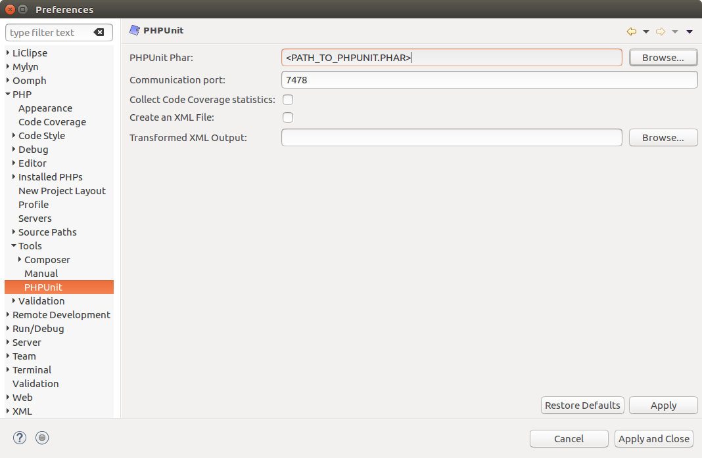

## Eclipse debugger

> Window > Preferences > PHP > Debug > Debuggers 

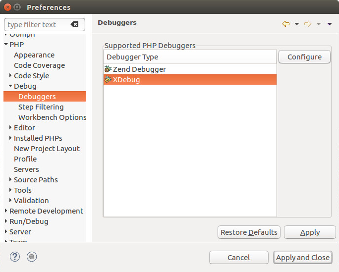

Select XDebug and configure it as follows :

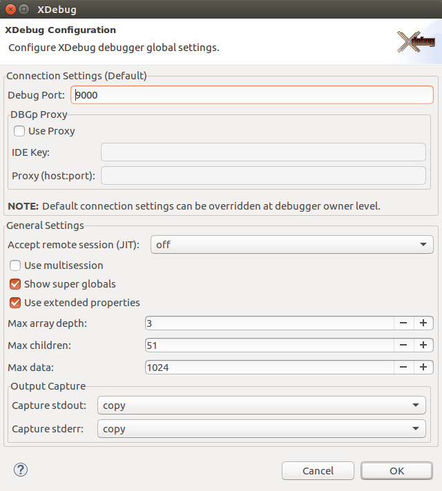

## Servers

> Window > Preferences > PHP > Servers

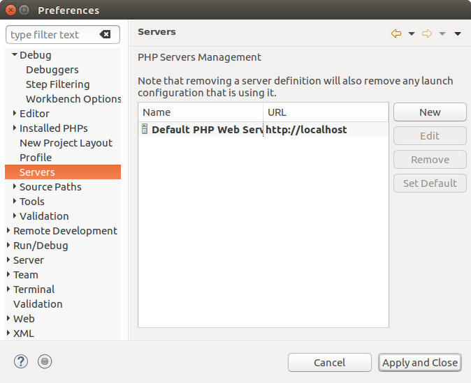

### Create your server

Press New, configure your server as follows (adapt the base URL and your document root path) and press Next.

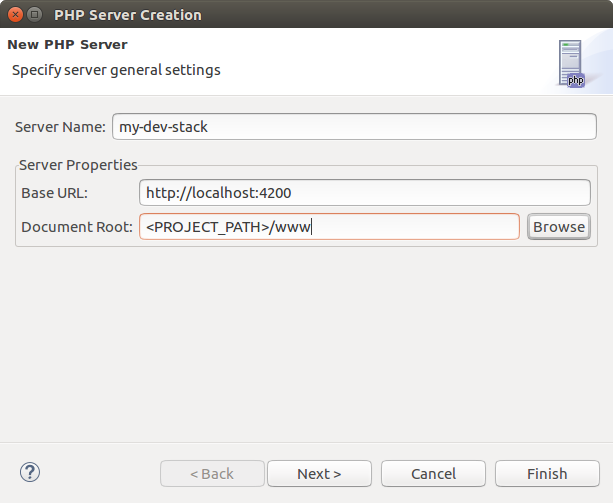

### Configure debugger

Select XDebug, configure as follows and press Next.

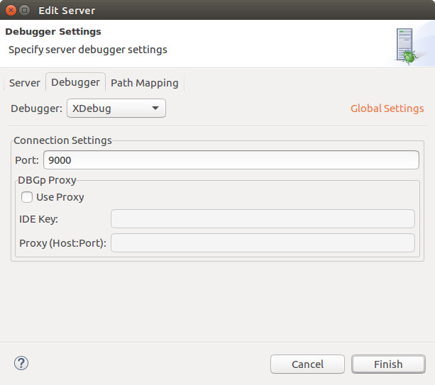

### Configure path mapping

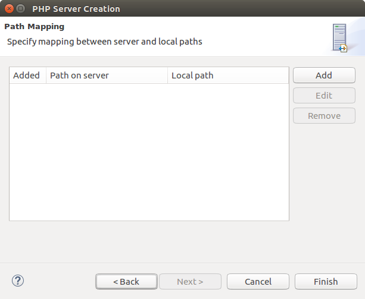

Add the following path mapping (adapt your project path) then press Finish and "Apply and Close".

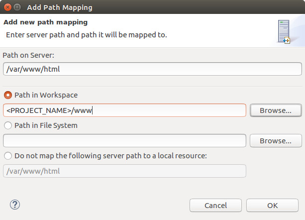

## Debug configurations

> Run > Debug Configurations...

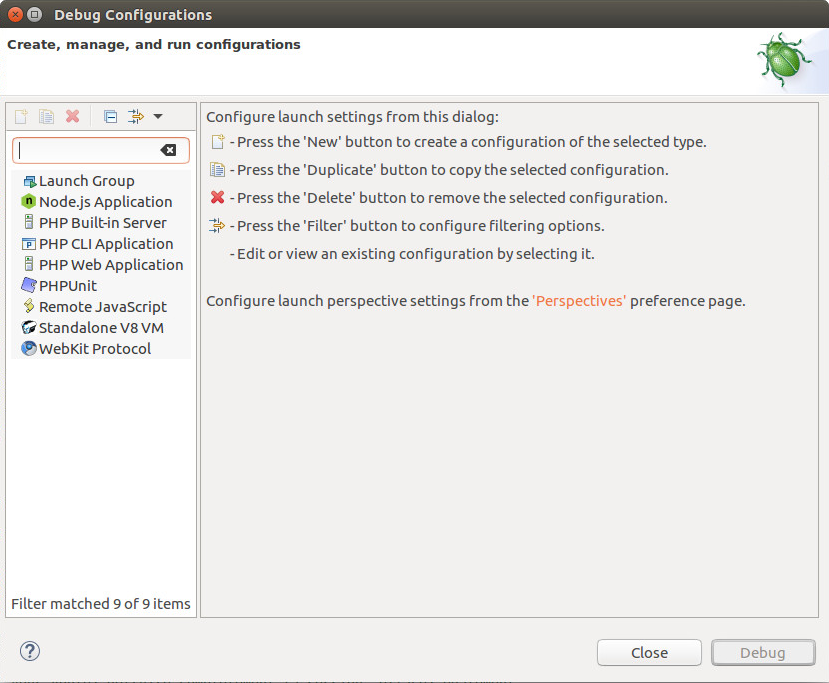

### Create a new `PHP Web Application` configuration

Configure Server tab as follows :

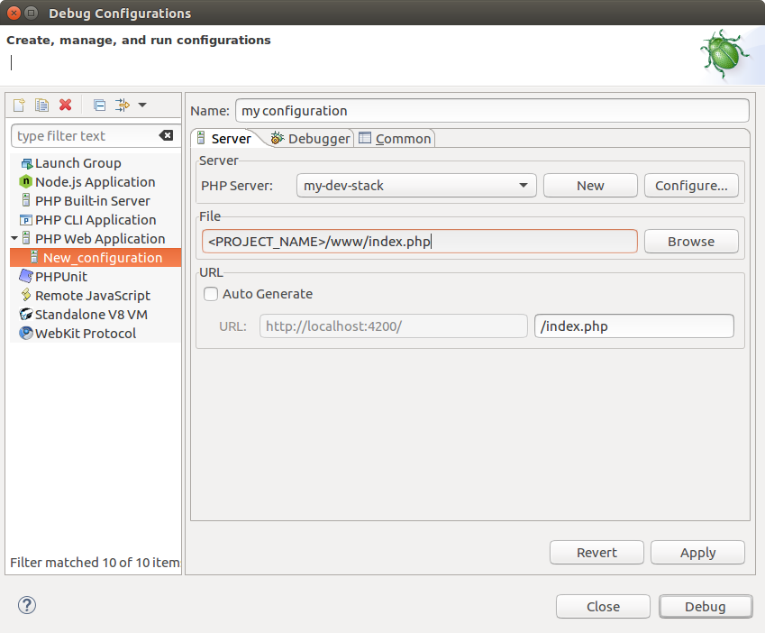

### Disable `Break at first line` option

Configure Debugger tab as follows and press Apply.

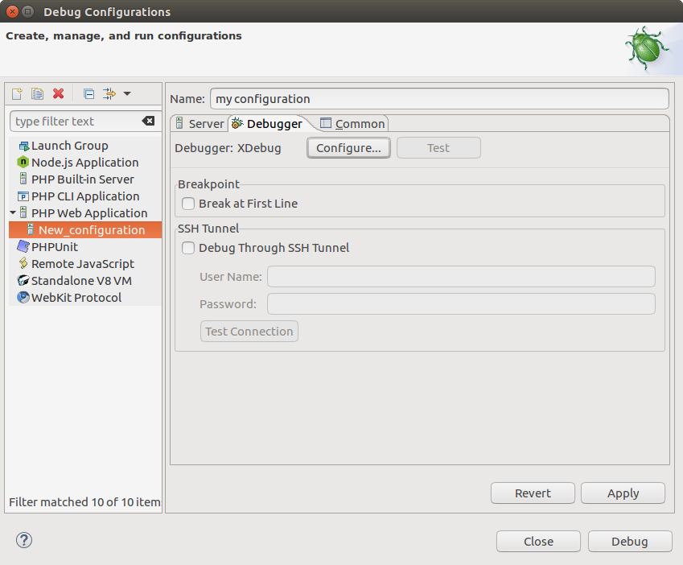


